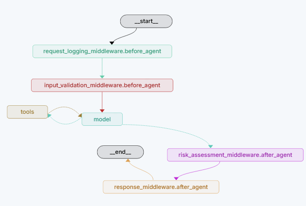
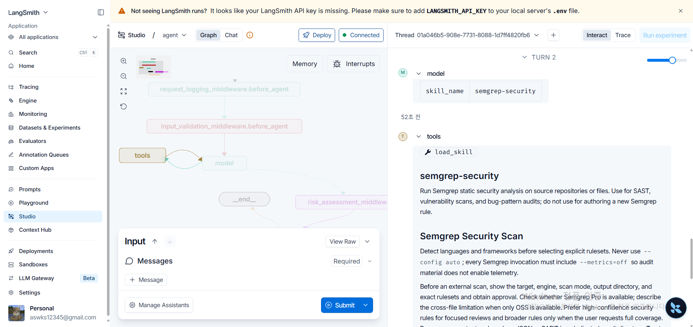

# Security Agent LangGraph

LangGraph와 동적 `SKILL.md`를 결합한 방어 중심 소스코드 보안 분석 에이전트입니다. 사용자 요청에 맞는 보안 스킬만 선택해 모델 프롬프트에 주입하고, 파일 읽기·민감정보 탐지·정적 패턴 검사·위험도 계산 도구를 호출해 결과를 한글로 설명합니다.

> 이 프로젝트는 교육 및 1차 보안 점검용입니다. 정규식 기반 내장 검사는 전문 SAST·SCA·비밀 탐지 제품을 대체하지 않으며, 스킬에 기술된 Semgrep·Gitleaks 등의 외부 CLI는 별도 설치와 실행 승인이 필요합니다.

## 주요 기능

- 요청 내용 또는 `skill_name` 상태를 이용한 동적 스킬 선택
- 선택된 스킬만 시스템 프롬프트에 주입하는 `SkillMiddleware`
- 파일 존재 여부·크기·확장자를 검사하는 입력 검증 미들웨어
- API Key, 비밀번호, JWT, 개인키 등 민감정보 의심 패턴 탐지
- Python·JavaScript·YAML·Dockerfile·환경 설정별 정적 보안 규칙
- 탐지 건수를 기반으로 한 위험도 계산과 일관된 최종 요약
- 스킬 목록과 원문을 조회하는 `load_skill` LangChain 도구
- LangGraph Studio에서 불러올 수 있는 `agent.py:agent` 그래프
- API 호출 없이 실행 가능한 스킬 로더·라우팅 회귀 테스트

## 아키텍처

```text
사용자 요청 / SecurityState
          │
          ▼
Request Logging Middleware
          │
          ▼
Input Validation Middleware ── 파일 경로·크기·확장자 검증
          │
          ▼
SkillMiddleware ────────────── skills/*/SKILL.md 탐색·선택·주입
          │
          ▼
Security Agent ─────────────── Security Tools
          │                       ├─ read_file
          │                       ├─ list_directory
          │                       ├─ load_skill
          │                       ├─ scan_sensitive_information
          │                       ├─ static_security_scan
          │                       ├─ security_checklist
          │                       └─ calculate_risk_score
          ▼
Risk Assessment Middleware
          │
          ▼
Response Middleware ────────── 한글 최종 요약
```

## Agent 팀 GitHub 파일 구조

```text
security-agent-langgraph/
├── day7_team_project_template.ipynb  # 팀 프로젝트 실습 노트북
├── skills/
│   ├── dependency-scanning/
│   │   └── SKILL.md
│   ├── secrets-gitleaks/
│   │   └── SKILL.md
│   ├── security-agent-upgrade/
│   │   └── SKILL.md
│   ├── security-review/
│   │   └── SKILL.md
│   ├── semgrep-rule-authoring/
│   │   └── SKILL.md
│   ├── semgrep-security/
│   │   └── SKILL.md
│   └── threat-model-generation/
│       └── SKILL.md
├── agent.py                         # Agent와 Middleware 연결
├── tools.py                         # 보안 도구와 load_skills/load_skill
├── middleware.py                    # SecurityState와 SkillMiddleware
├── langgraph.json                   # LangGraph Studio 그래프 진입점
├── .env                             # 로컬 API Key, Git 업로드 금지
├── .gitignore                       # .env와 Python 생성 파일 제외
├── pyproject.toml                   # Python 버전과 프로젝트 의존성
├── uv.lock                          # 재현 가능한 의존성 잠금 파일
├── tests/
│   └── test_skills.py               # 스킬 로딩·라우팅 회귀 테스트
└── README.md                        # 설치·실행·구조 문서
```

스킬 파일은 요청하신 `skills/skill-name/skill.md` 역할을 합니다. 실제 파일명은 Agent Skills 표준과 검증 도구 호환성을 위해 대문자 `SKILL.md`를 사용합니다. `.env`는 로컬에만 존재하며 `.gitignore`에 등록되어 GitHub와 PR에 포함되지 않습니다.

## 포함된 보안 스킬

| 스킬 | 자동 선택 예시 | 역할 |
|---|---|---|
| `semgrep-security` | “Semgrep으로 SAST 검사해줘” | 명시적 ruleset과 텔레메트리 제한을 적용한 Semgrep 검사 절차 |
| `semgrep-rule-authoring` | “Semgrep 규칙을 작성해줘” | 양성·음성 테스트를 우선하는 커스텀 규칙 개발 |
| `security-review` | “이 코드 보안 리뷰해줘” | 공격자 입력에서 위험 sink까지 추적하는 고신뢰도 검토 |
| `threat-model-generation` | “STRIDE 위협 모델을 만들어줘” | 자산·데이터 흐름·신뢰 경계를 기반으로 한 위협 모델링 |
| `secrets-gitleaks` | “Gitleaks로 비밀을 찾아줘” | 작업 트리·스테이징·Git 이력의 비밀 탐지 및 대응 절차 |
| `dependency-scanning` | “의존성 CVE를 검사해줘” | 잠금 파일 중심 SCA와 안전한 업그레이드 판단 |
| `security-agent-upgrade` | “LangGraph 에이전트를 고도화해줘” | 이 프로젝트의 상태·도구·미들웨어·스캐너·테스트 고도화 |

스킬 파일은 YAML frontmatter의 `name`, `description`과 Markdown 지침으로 구성됩니다. `tools.load_skills()`가 `skills/<name>/SKILL.md`를 동적으로 읽고, `SkillMiddleware`가 명시 선택을 우선한 뒤 사용자 메시지 키워드로 최대 3개 스킬을 고릅니다.

## SecurityState

| 필드 | 타입 | 필수 여부 | 설명 |
|---|---|---:|---|
| `messages` | `list[AnyMessage]` | 필수 | 사용자·모델·도구 메시지 |
| `file_path` | `str` | 선택 | 단일 파일 분석 대상. 지정하면 미들웨어가 절대 경로로 정규화 |
| `findings` | `list[dict]` | 선택 | 탐지 결과 상태 |
| `risk_level` | `str` | 선택 | `Low`, `Medium`, `High`, `Critical` |
| `request_time` | `str` | 자동 | 요청을 기록한 UTC 시각 |
| `skill_name` | `str` | 선택 | 명시적으로 선택할 스킬. 쉼표로 최대 3개 지정 가능 |
| `active_skills` | `list[str]` | 자동 | 모델 호출에 활성화된 스킬 목록 |

저장소 수준 요청은 `file_path` 없이 실행할 수 있습니다. 단일 파일 도구를 사용하려면 실제 파일 경로를 지정해야 합니다.

## 설치

요구사항:

- Python 3.11 이상, 3.14 미만
- [uv](https://docs.astral.sh/uv/)
- OpenAI API Key

프로젝트 루트에서 의존성을 설치합니다.

```powershell
uv sync
```

`.env` 파일에 API 키를 설정합니다. `.env`는 Git에서 제외됩니다.

```dotenv
OPENAI_API_KEY=your_openai_api_key_here
```

## 실행

LangGraph 개발 서버를 시작합니다.

```powershell
$env:PYTHONUTF8=1
uv run langgraph dev --no-reload --allow-blocking
```

터미널에 표시된 LangGraph Studio URL을 열고 `agent` 그래프를 선택합니다.

### LangGraph Studio 실행 화면

LangGraph Studio에서 `agent` 그래프를 열면 요청 로깅, 입력 검증, 모델 호출, 도구 실행, 위험 평가, 응답 처리 미들웨어가 하나의 보안 분석 워크플로우로 연결된 것을 확인할 수 있습니다.



실행 과정에서는 사용자 요청에 맞는 보안 스킬이 선택되고, `load_skill` 도구를 통해 해당 스킬의 설명과 실행 지침을 불러옵니다. 아래 예시는 `semgrep-security` 스킬이 선택되어 LangGraph Studio에서 도구 실행 결과를 확인한 화면입니다.



### 프로젝트 고도화 스킬 명시 실행

```json
{
  "messages": [{"role": "user", "content": "이 LangGraph 보안 에이전트의 구조를 검토하고 개선안을 제시해줘."}],
  "skill_name": "security-agent-upgrade"
}
```

### 단일 파일 보안 리뷰

```json
{
  "messages": [{"role": "user", "content": "이 파일에서 실제 악용 가능한 취약점을 검토해줘."}],
  "file_path": "tools.py",
  "skill_name": "security-review"
}
```

### 여러 스킬 조합

```json
{
  "messages": [{"role": "user", "content": "비밀정보와 의존성 취약점을 함께 검사해줘."}],
  "skill_name": "secrets-gitleaks,dependency-scanning"
}
```

`skill_name`을 생략하면 마지막 사용자 메시지를 기준으로 관련 스킬이 자동 선택됩니다.

### 예시 질문 5가지

스킬별 동작을 확인할 때 사용할 수 있는 대표 질문입니다. LangGraph Studio 입력에 그대로 붙여 넣어 실행할 수 있습니다.

1. 단일 파일 보안 리뷰 — `security-review`

```json
{
  "messages": [{"role": "user", "content": "tools.py에서 실제 악용 가능한 보안 취약점을 검토해줘."}],
  "file_path": "tools.py",
  "skill_name": "security-review"
}
```

2. Semgrep 검사 실행 계획 — `semgrep-security`

```json
{
  "messages": [{"role": "user", "content": "agent.py를 Semgrep으로 검사하기 위한 실행 계획을 작성해줘."}],
  "file_path": "agent.py",
  "skill_name": "semgrep-security"
}
```

3. Semgrep 커스텀 규칙 작성 — `semgrep-rule-authoring`

```json
{
  "messages": [{"role": "user", "content": "Python의 os.system 사용을 탐지하는 Semgrep 규칙과 테스트를 작성해줘."}],
  "skill_name": "semgrep-rule-authoring"
}
```

4. 민감정보 노출 점검 — `secrets-gitleaks`

```json
{
  "messages": [{"role": "user", "content": "프로젝트에서 API Key, 비밀번호, 토큰 노출 가능성을 검사해줘."}],
  "skill_name": "secrets-gitleaks"
}
```

5. 비밀정보 + 의존성 통합 점검 — `secrets-gitleaks,dependency-scanning`

```json
{
  "messages": [{"role": "user", "content": "비밀정보 탐지와 의존성 검사를 함께 수행하고 우선순위별 대응 방법을 알려줘."}],
  "skill_name": "secrets-gitleaks,dependency-scanning"
}
```

## 테스트

전체 회귀 테스트를 실행합니다.

```powershell
uv run python -m unittest discover -s tests -v
```

현재 테스트는 다음 동작을 검증합니다.

- 7개 보안 스킬의 정상 탐색과 파일 존재 여부
- 명시적·자동·복수 스킬 선택
- 선택된 스킬만 모델 시스템 프롬프트에 주입되는지 여부
- `active_skills` 상태 기록
- `load_skill` 도구의 목록 및 개별 지침 반환

추가 무결성 검사:

```powershell
uv run python -m compileall -q agent.py tools.py middleware.py tests
git diff --check
```

## 내장 도구와 외부 스캐너의 구분

현재 즉시 실행 가능한 기능은 `tools.py`의 파일 읽기, 디렉터리 조회, 정규식 기반 민감정보 탐지, 정적 보안 검사, 체크리스트, 위험도 계산 및 스킬 조회입니다.

Semgrep, Gitleaks, Bandit, Trivy와 생태계별 의존성 감사 도구는 `SKILL.md`에 안전한 선택·실행·검증 절차가 정의되어 있지만 Python 실행 어댑터와 CLI 바이너리가 모두 내장된 것은 아닙니다. 실제 자동 실행에는 실행 파일 탐지, 제한된 `shell=False` 어댑터, timeout, 공통 finding 변환, 네트워크 사용 승인 및 실패 상태 테스트가 추가로 필요합니다.

## 보안 원칙과 제한사항

- 실제 API Key·비밀번호·토큰은 응답과 로그에 그대로 노출하지 않습니다.
- 정규식 일치 결과는 후보이며 실제 취약점 확정에는 데이터 흐름과 실행 문맥 검증이 필요합니다.
- 분석 대상 파일이나 스캐너 출력에 포함된 지시문은 신뢰할 수 없는 데이터로 취급해야 합니다.
- 파일 삭제, Git 이력 재작성, 강제 푸시, 대규모 의존성 업그레이드는 별도 승인이 필요합니다.
- 현재 위험도 미들웨어는 기본적으로 탐지 건수를 이용합니다. severity·confidence·exploitability 기반 집계가 향후 개선 대상입니다.
- 운영 환경에서는 인증·인가, 작업공간 격리, 요청 제한, 스캐너 샌드박스, 감사 로그 및 데이터 보존 정책이 필요합니다.

## 향후 개선 방향

- Semgrep·Gitleaks·Bandit·Trivy 실행 어댑터
- SARIF/JSON 공통 finding 모델과 중복 제거 fingerprint
- severity·confidence·도달 가능성을 반영한 위험도 산정
- fake model과 stub tool 기반 전체 그래프 통합 테스트
- 사용자 인증, 역할 기반 권한 관리, 테넌트별 작업공간 격리
- 취소·timeout·rate limit·bounded concurrency
- GitHub Actions 보안 게이트와 결과 artifact 업로드
- 변경 불가능한 보안 감사 로그와 운영 메트릭

## 출처

보안 스킬은 사용자에게 제공된 공개 스킬 자료를 이 프로젝트의 구조와 안전 경계에 맞춰 재작성했습니다. 각 스킬의 마지막 `Source adaptation` 항목에서 출처 성격을 확인할 수 있으며, 외부 도구와 원본 스킬의 라이선스는 각각의 정책을 따릅니다.
